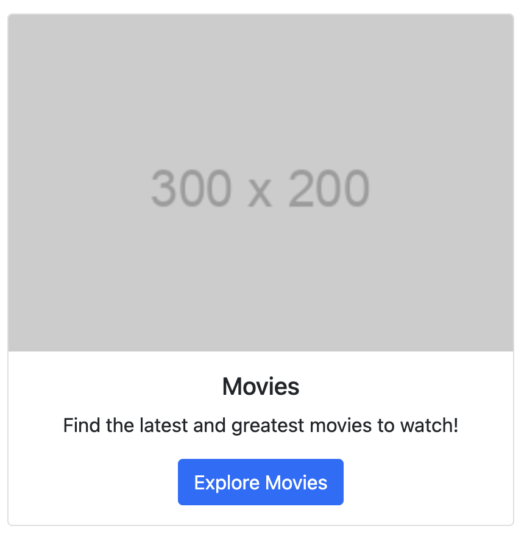

# User Manual
## Getting Started
### Creating an Account
To begin using TREND, the user should utilize the Login/Register in the top right of the webpage as shown below.

Assuming the user has not created an account yet, click "Register" and type a username along with a password and password confirmation. 

Once the account is created, It will bring the user back to the login page. 

Fill out the login page with your credentials, select login, and you will be free to continue using the application. 

The user will then be prompted to fill out surveys for each of the three categories TREND supports including activities, restaurants, and movies. First, the user will be asked which surveys they want to complete. 

### Completing User Surveys
Once an account has been created, the user is logged in, and the surveys are selected, TREND will prompt for the user to fill out the chosen surveys before using the recommendation engine. The surveys look as follows: 

After the user completes the surveys, they will be able to make requests to the recommendation engine to give results based on the initial surveys and current location. 

## Using TREND
### Homepage Navigation
As shown below, the homepage has three cards for each category of recommendations. 

Simply select the one you would like and view the results.

### Category - Activities
The third panel is for activities. 

When selecting activities, the browser will ask you for your location to tailor results to you. 

If you select the activities category, it will pull up a page of results given your initial preferences and then further input (WIP).

### Category - Dining
The second panel is for dining. 

When selecting dining, the browser will ask you for your location to tailor results to you. 

If you select the dining category, it will pull up a page of results given your initial preferences and then further input (WIP).

### Category - Movies (WORK IN PROGRESS)
The first panel is for movies. 

## System Architecture
### System Diagram

### Technical Components
- **User Interface**: Handles user input and displays the interface screens to the user.
- **Login Service**: Allows user profile creation and sign-in through flask_login.
- **Initial Interests Survey Generator**: Creates a group of questions for the user, designed to help narrow personal recommendations and build initial data for the user’s profile.
- **Movie Query Filter**: Filter implemented to pull user data to narrow down the movie recommendation.
- **TMDB API Manager**: Interacts with the TMDB website to pull movie recommendations from their database based off the search we send through the API
- **Geolocation API Manager**: Pulls the user’s location to further add user’s profile for a more accurate recommendation
- **Dining/Activities Filter**: Step in which the app pulls the user preferences from the user data to narrow the search through Places API.
- **Places API Manager**: Interacts with the Google Places service to return the dining/activities in a local radius to the user.
- **OpenAI API Manager**: Interacts with the OpenAI service to take in the options we provide and return a recommendation.
- **Maps API Manager**: Interacts with the Google Maps service to provide a visual display of the location of the recommendation.

### Libraries and Frameworks
- **Flask**: Web Framework
- **Flask_login**: package to offer login setup from flask
- **Flask_sqlalchemy**: SQL Database (python queries instead of SQL)
- **TMDB API**: API to send searches through the TMDB website for movie recommendations
- **BootStrap**: HTML/CSS Framework
- **SQLite**: Alternative Database Option
- **Google Maps API**: API to show location data based on Places API data
- **Places API**: API to Obtain Crucial Geographic Information and Reviews
- **OpenAI API**: API to utilize a LLM to curate recommendations
- **Navigator_geolocation API**: API to pull location from browser